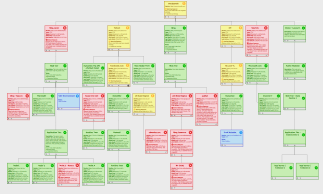
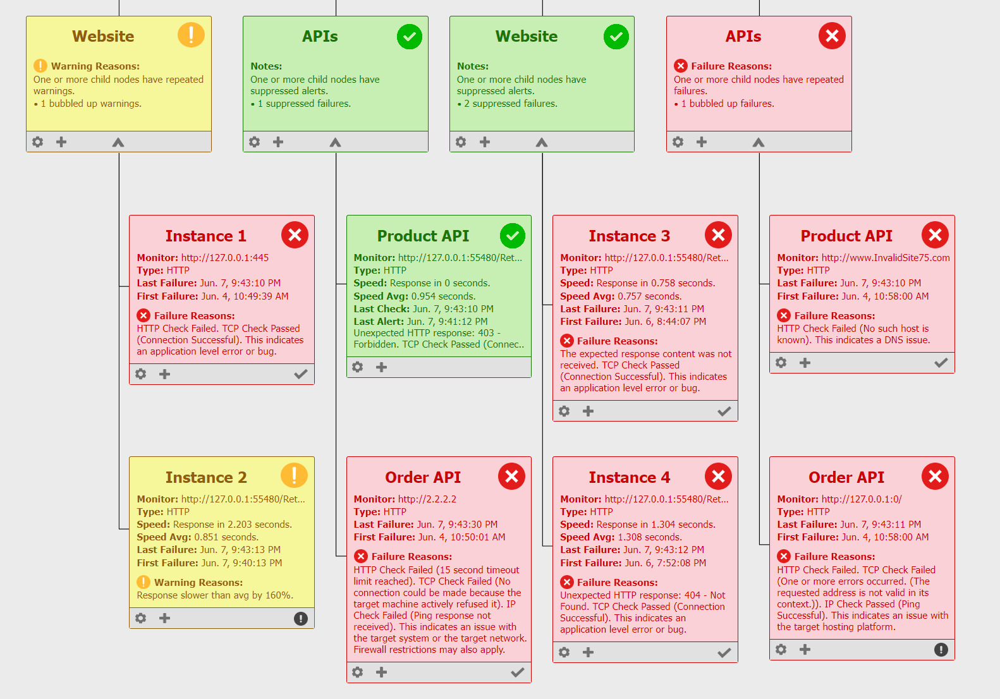

<!-- Improved compatibility of back to top link: See: https://github.com/othneildrew/Best-README-Template/pull/73 -->

<!-- PROJECT SHIELDS -->
<!--
*** I'm using markdown "reference style" links for readability.
*** Reference links are enclosed in brackets [ ] instead of parentheses ( ).
*** See the bottom of this document for the declaration of the reference variables
*** for contributors-url, forks-url, etc. This is an optional, concise syntax you may use.
*** https://www.markdownguide.org/basic-syntax/#reference-style-links
-->
[![Stargazers][stars-shield]][stars-url]
[![Issues][issues-shield]][issues-url]
[![LinkedIn][linkedin-shield]][linkedin-url]

<!-- PROJECT LOGO -->
 

  

  <h1 align="center">HandyDash</h1>
  <h2 align="center">Operational Monitoring Made Easy.</h2>

  

    HandyDash is a HTTP, TCP, and IP monitoring tool, intended for desktop use. It is agent free, requires no installation, and saves all configuration to a single portable file. Simply unzip the package and run the executable to view and edit nodes within the browser based UI. 
     
     
    <a href="https://github.com/Nathan-Handy/HandyDash/issues/new?labels=bug&template=bug-report---.md">Report Bug</a>
    ·
    <a href="https://github.com/Nathan-Handy/HandyDash/issues/new?labels=enhancement&template=feature-request---.md">Request Feature</a>
  

<!-- TABLE OF CONTENTS -->

  
Table of Contents

  <ol>
    <li>
      <a href="#about-the-project">About </a>
    </li>
    <li>
      <a href="#getting-started">Getting Started</a>
    </li>
    <li><a href="#usage">Usage</a></li>
    <li><a href="#roadmap">Roadmap</a></li>
    <li><a href="#license">License</a></li>
    <li><a href="#contact">Contact</a></li>
    <li><a href="#acknowledgments">Acknowledgments</a></li>
  </ol>

<!-- ABOUT THE PROJECT -->
## About The Project

Welcome to HandyDash. I set about developing this software with the following features in mind:

* I wanted a tool that could be run with a single click, that doesn't require the installation of agents on target systems.
* I wanted a tool that is simple to configure, without requiring programming or scripting knowledge.  
* I wanted a tool that visually represents the platform that my teams are monitoring.
* I wanted a tool that distinguishes the criticallity of different events.
* I wanted a tool that distinguishes between application failures and lower level connectivity failures.
* I wanted a tool that articulates failures in a way that is actionable for my operations team.
* I wanted a tool that links dependent systems and propogates related failures.

Please see [my blog](https://www.nathanhandy.blog/articles/) for further discussion of application and systems monitoring.

(<a href="#readme-top">back to top</a>)

<!-- GETTING STARTED -->
## Getting Started

HandyDash is intended for quick and easy desktop use, with very little setup.
1. Download and unzip HandyDash-v1.0.zip
2. Run the executable HandyDash.exe
3. Add and edit monitor configurations using the Plus and Cog icons shown.

That's it!

(<a href="#readme-top">back to top</a>)

<!-- USAGE EXAMPLES -->
## Usage

Please check again soon for an overview of HandyDash features and basic usage.

(<a href="#readme-top">back to top</a>)

<!-- ROADMAP -->
## Roadmap

As visible within the UI, some features are not yet fully implemented. I plan on completing these features as time permits. A star in GitHub or an email will certainly help with motivation, so please feel free to contact me using the details further below.

(<a href="#readme-top">back to top</a>)

<!-- LICENSE -->
## License

HandyDash v1.0 is free, however it is not open-source. Please see `LICENSE.txt` for full license details.

(<a href="#readme-top">back to top</a>)

<!-- CONTACT -->
## Contact

**Nathan Handy** - All feedback and questions are welcome. If you encounter any bugs please [raise an issue](https://github.com/Nathan-Handy/HandyDash/issues).

* Email: nathanhandyblog@gmail.com
* Personal Blog: [www.nathanhandy.blog](https://www.nathanhandy.blog/)
* Twitter / X: [_H4NDY](https://x.com/_H4NDY)
* LinkedIn: [www.linkedin.com/in/nahandy](https://www.linkedin.com/in/nahandy/)

(<a href="#readme-top">back to top</a>)

<!-- ACKNOWLEDGMENTS -->
## Acknowledgments

HandyDash makes use of the following open source frameworks and templates.

* [Treant.js](https://fperucic.github.io/treant-js/)
* [Raphaël](https://github.com/DmitryBaranovskiy/raphael)
* [Zoomooz.js](https://jaukia.github.io/zoomooz/)
* [Loading-Bar.js](https://loading.io/progress/) 
* [jQuery](https://jquery.com)
* [othneildrew](https://github.com/othneildrew/Best-README-Template)

(<a href="#readme-top">back to top</a>)

<!-- MARKDOWN LINKS & IMAGES -->
<!-- https://www.markdownguide.org/basic-syntax/#reference-style-links -->
[stars-shield]: https://img.shields.io/github/stars/Nathan-Handy/HandyDash.svg?style=for-the-badge
[stars-url]: https://github.com/Nathan-Handy/HandyDash/stargazers
[issues-shield]: https://img.shields.io/github/issues/Nathan-Handy/HandyDash.svg?style=for-the-badge
[issues-url]: https://github.com/Nathan-Handy/HandyDash/issues
[license-shield]: https://img.shields.io/github/license/Nathan-Handy/HandyDash.svg?style=for-the-badge
[license-url]: https://github.com/Nathan-Handy/HandyDash/blob/master/LICENSE.txt
[linkedin-shield]: https://img.shields.io/badge/-LinkedIn-black.svg?style=for-the-badge&logo=linkedin&colorB=555
[linkedin-url]: https://www.linkedin.com/in/nahandy/
[product-screenshot]: images/screenshot.png
